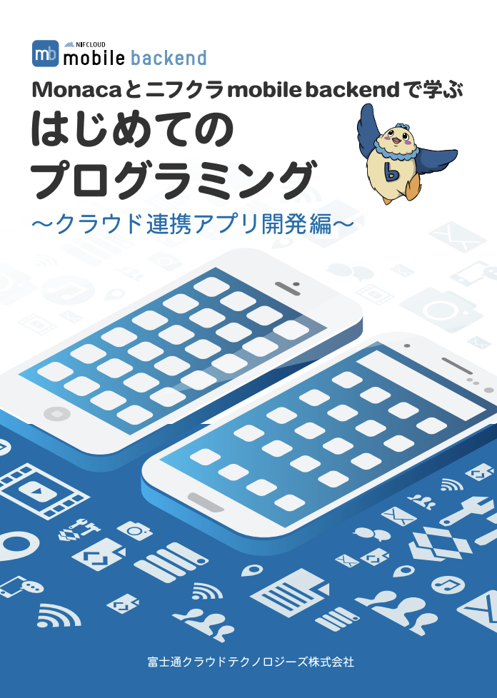

name: inverse
layout: true
class: center, middle, inverse
---
## バージョン管理ができて更新も容易な セミナー資料の作り方

.right[]

.footnote[
20180731 LT by Natsumo Ikeda
]

---
layout: true
class: center, middle, inverse_sub
---
# はじめに

---
layout: false

.footnote_right[
はじめに
]

## アジェンダ
* 自己紹介
* セミナー資料の作り方

---
layout: true
class: center, middle, inverse_sub
---
# 自己紹介

---
layout: false

.footnote_right[
自己紹介
]

## 自己紹介

.right-column[.center[

]]

.left-column[.size_small_9[ 
* 池田 夏藻
  * Ikeda Natsumo
* 大学院卒
   * 数学やってました
* バイト歴
  * ユニクロ ４年くらい
  * auコールセンター ２年くらい
  * 飲食 少し
  * 家庭教師、塾講師 少し
* 社会人歴
   * 中学校教師 ３年半
   * 某IT企業 ２年半
   * FJCTに入社して今に至る  
* 特技
  * 数学、バスケ、スノボー、 人にメイクをする
* 趣味
  * ホットヨガ、絵を描く、 服を作る、買い物
]]

---
.footnote_right[
自己紹介
]

## 最近のメイン業務

.right-column[.cneter[

]]

.left-column[
1. __mBaaSのセミナー企画運営__
  * ハンズオンセミナー
  * ビジネスセミナー  
1. __アシアル社（Monaca）との連携__
  * Webセミナーの開催
  * 教育連携
    * 参考書作っています！ （8/8完成予定）

      
.color_pink[
★日頃から資料作成が結構多いです
]
]

---
layout: true
class: center, middle, inverse_sub
---
# セミナー資料の作り方

---
layout: false

.footnote_right[
セミナー資料の作り方
]

## 資料作りあるある

.size_large_11[
* パワポがフリーズしてせっかく作ったデータが飛んだ
* 知らぬ間に画像パーツが変な所に移動していた
* 更新のたびファイルが増えていく
* そもそもファイルがどこに行ったかわからなくなった
]

などなど

---
.footnote_right[
セミナー資料の作り方
]

## パワポを使わない資料作りの方法

* レシピ
  * [【GitHub】マークダウンで簡単にスライド資料を作成する方法 - Qiita](https://qiita.com/natsumo/items/717e40de2c43824624b6)
* 用意するもの
  * GitHubアカウント
  * MarkDownの知識
* 例
  * この資料

---
.footnote_right[
セミナー資料の作り方
]

## Strong Point

* 簡単、シンプル、見やすい
* MarkDownで書ける
  * メモからの資料化も楽々
  * エディターは [Atom](https://atom.io/) がおすすめ！
* GitHubなのでバージョン管理は完璧
* ハンズオン中に使用するコードのコピペができる
  * PDFのコピペだと文字化けしたりうまくコピーが取れないことがある
* もともとWeb上で管理するので、公開URLが自動で発行される
  * この資料URL： https://natsumo.github.io/natsumo

## Weak Point

* GitHubの無料アカウントだと非公開にできないので社外秘資料は作れない
* コードを見たくない人には抵抗がある

 
.right[.color_pink[
興味がある方はぜひ使って見てください！
]]

---
layout: true
class: center, middle, inverse_sub
---
.center[
## ご清聴ありがとうございました！
]
